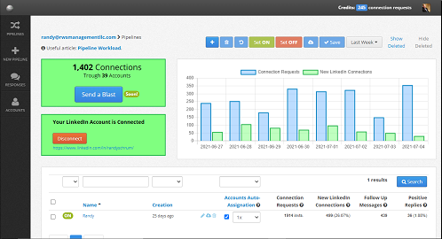
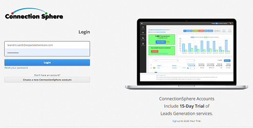

# free-membership-sites

**IMPORTANT:**
This project is under construction.
The first version will be released on 1-Jun-2022.
Check out [our roadmap here](https://github.com/users/leandrosardi/projects/5).

**free-membership-sites** is an open-source, extensible and scalable platform for develop your own SaaS, e-Commerce, Education Platform, Social Network, Forum or any kind of memberships based product.



Use **free-membership-sites** to develop any kind of:
- softwares as a service;
- educational site;
- e-commerce store;
- forum;
- social network;
- etc.

If you have skills in any of: design, Ruby, PostgreSQL or Bootstrap and would like to tackle something on this roadmap, we'd be grateful!

## Getting Started

**Step 1:** Install the Environment

If you are running on Ubuntu 18.04 or Ubuntu 20.04, you can run these commands for install both `Ruby 3.1.2` and `PostgreSQL 14`.

```
cd /tmp
wget https://raw.githubusercontent.com/leandrosardi/free-membership-sites/main/cli/install-environment.sh
bash ./install-environment.sh
```

If you get a permissions error, prefix the command with sudo.

If you are not running on Ubuntu 18.04 or Ubuntu 20.04, the command above may not work.

**free-memembership-sites** has been tested with Ruby 3.1.2 and PostgreSQL 14.
Other version may not be stable.

**Step 2:** Clone the project.

Get the source code from GitHub.

```bash
mkdir ~/code
cd ~/code
git clone https://github.com/leandrosardi/free-membership-sites
```

If you get a permissions error, prefix the command with sudo.

**Step 3:** Install the App

The command below performs many installation tasks:

```bash
cd ~/free-membership-sites
ruby ./install.rb
```

Such installation tasks are:
1. installing required gems;
2. creating the database schema;
3. inserting seed records into the database; and
4. setup configuration file.

**Step 4:** Run the Web Server

```bash
cd ~/free-membership-sites
ruby ./cli/run.rb db=kepler 
```

Finally, open a new browser, go to [http://127.0.0.1:80/login](http://127.0.0.1:80/login) and access with default user `demo` and password `demo`.



## Features & Documentation

Some features of **free-membership-sites** include:

1. [account management](./docu/1.accounts-management.md);

2. [invoicing and payments processing](./docu/2.invoicing-and-payments-processing);

3. [email notifications](./docu/3.email-notifications) with easy setup of automation rules;

4. [affiliates tracking](./docu/4.affiliates-tracking) for managing resellers and pay commission;

5. [domain aliasing](./docu/5.domain-aliasing) for licencing your site to other companies;

6. [abuse preventing](./docu/6.abuse-preventing) by tracking user's network and browser fingertings;

7. [shadow profiling](./docu/7.shadow-profiling) [[1](https://en.wikipedia.org/wiki/Shadow_profile)] for sales optimizations and client retention;

8. [SSL certificates](./docu/8.ssl-certificates) support;

9. [horizontal scalability](./docu/9.horizontal-scalability) of both: database and webservers;

10. [access points publishing](./docu/10.access-points-publishing) to connect your site with any other products;

11. [background processesing](./docu/11.background-processesing) for offline tasks like reports generation, payments processing, email notifications, web scraping, other tasks planning or dispatching, etc.;

12. [extensiblilty](./docu/12.extensiblilty), writing your own modules or installing the modules of thirth parties;

13. automated deploying;

14. stored parameters;

15. appendix 1: writing modules;

16. appendix 2: managing transcactional and historical data;

17. appendix 3: archiving inactive account.


